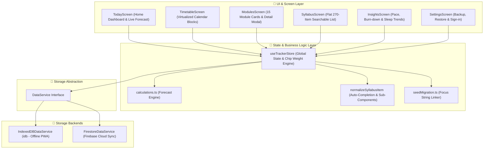
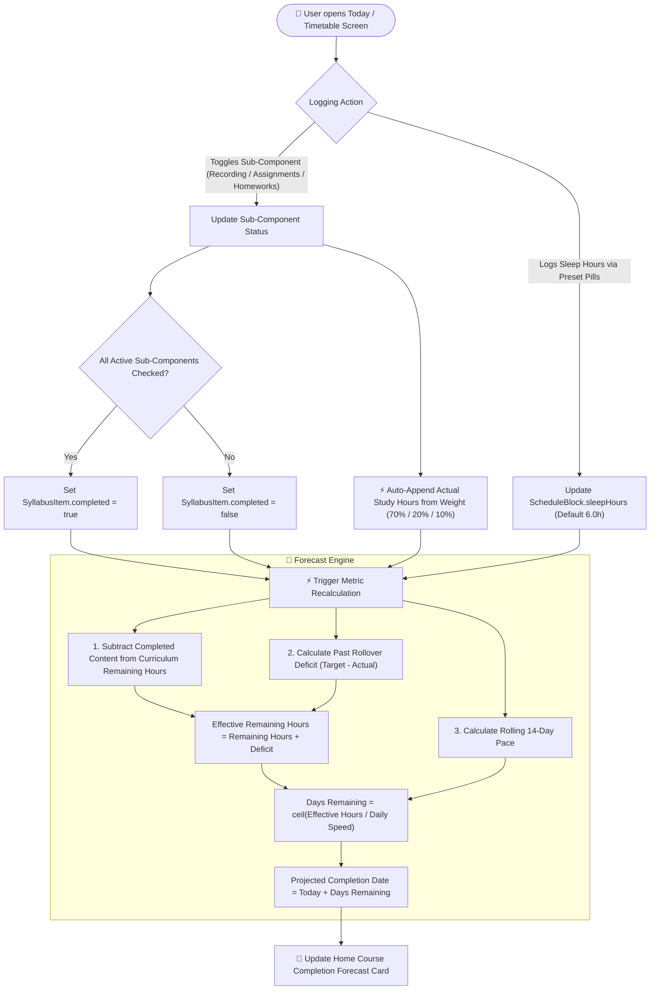
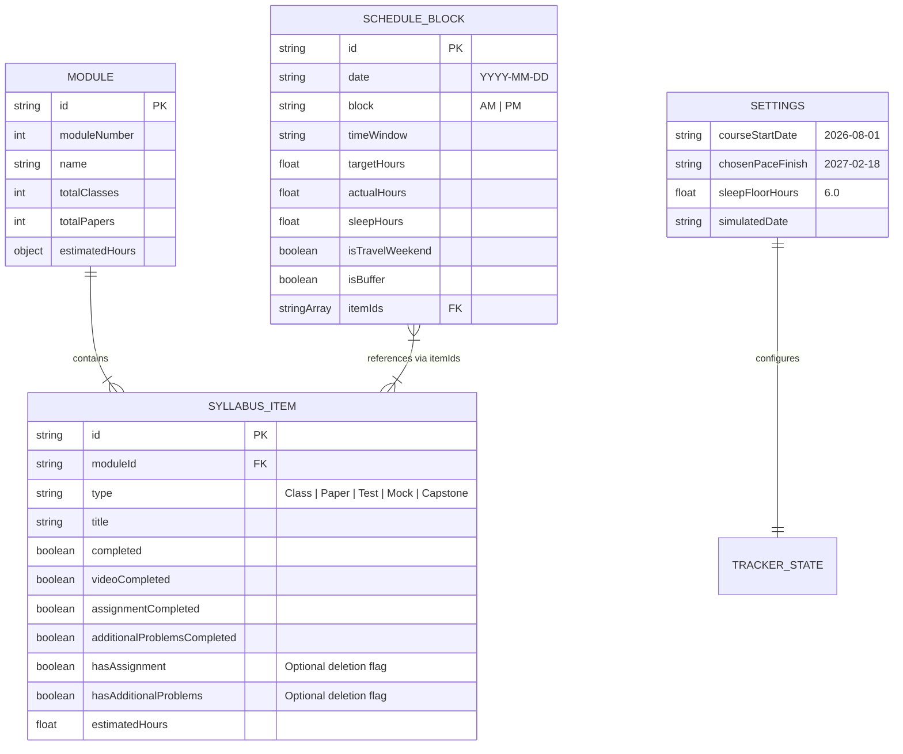

# Scaler AI/ML Certification Tracker 🎓⚡

> A personal, mobile-first, offline-ready web application built with **React 18 + TypeScript + Vite + Tailwind CSS** to track curriculum progress, log actual study/sleep hours, and dynamically forecast course completion for the **Scaler AI/ML Certification Program**.

---

## 🏗️ System Architecture

The application adopts a clean 3-tier architecture with a decoupled **`DataService` Storage Abstraction**, allowing seamless switching between **100% offline IndexedDB** storage and **Firebase Cloud Synchronization** without altering component code.



---

## 🔄 Business Logic & Forecast Process Flow

The flowchart below illustrates how daily logging, class sub-component completion (Recording, Assignments, Homeworks), auto-appended study hours, deficit rollover, and live finish date forecasting interact in real time:



---

## 📊 Data Model & Entity Relationships



---

## 🌟 Key Features

### 1. 📹 Class Sub-Components & Dynamic Weight Redistribution
Each Class lecture tracks three standardized sub-components:
- 📹 **Recording** (`videoCompleted`) — *Default weight: 70%*
- 📝 **Assignments** (`assignmentCompleted`) — *Default weight: 20%*
- 🧩 **Homeworks** (`additionalProblemsCompleted`) — *Default weight: 10%*

* **Auto-Appended Actual Hours**: Actual study hours automatically accumulate as you mark each sub-component complete (e.g. 1.05h for 70% Recording, 0.30h for 20% Assignments, 0.15h for 10% Homeworks), eliminating tedious manual hours typing.
* **Inline Deletion Chips (`✕`)**: Delete non-applicable Assignments or Homeworks directly inside their pill chips. Deleting a sub-component automatically transfers its percentage weight to the **Recording** chip (up to 100%).
* **Sub-Component Restoration (`+ Add` Dropdown)**: Restore deleted Assignments or Homeworks anytime via the dashed `+ Add` button dropdown menu (`+ Assignments (20%)`, `+ Homeworks (10%)`).
* **Auto-Completion & Bi-Directional Sync**: When all active sub-components are checked, the main class item marks itself **Completed (`completed = true`)** automatically. State updates sync bidirectionally across Today, Timetable, Modules, and Syllabus views in real time.

---

### 2. 😴 Simplistic Sleep Logging (Default 6.0h)
* **1-Tap Preset Selector**: Log nightly sleep instantly using 1-tap preset pills (`5.0h`, `5.5h`, `6.0h` (default), `6.5h`, `7.0h`, `7.5h`, `8.0h`, `8.5h`, `9.0h`).
* **Fine-Tuner Steppers**: Adjust sleep hours by `-15 mins` or `+15 mins` with stepper controls.
* **Dedicated Recovery Card**: Placed in a distinct section on the Today page (`DailySleepLogCard.tsx`) separate from daily study blocks.
* **Sleep Floor Warning Banner**: Persistent alert triggered when trailing 5 logged days fall below the 6.0-hour sleep floor.

---

### 3. 🔄 Deficit Rollover & Hours Carry-Forward
* **Unstudied Hours Rollover**: When study sessions or streaks are interrupted or under-studied, the unstudied hours deficit (`targetHours - actualHours`) is carried forward into your remaining workload.
* **Dynamic Completion Forecast**: Adjusts your effective remaining workload and automatically shifts your projected completion date to provide a realistic catch-up timeline.
* **Fast Completion Efficiency**: When you complete 4.0 hours of curriculum content in 3.0 actual hours, **no deficit is generated** and your projected finish date moves earlier!

---

### 4. 📊 Today (Home) Dashboard & Live Forecast Card
* **Hero Course Completion Forecast**: Displays live projected finish date, finish delta (+/- days), carried-forward deficit, and rolling weekly pace.
* **Date Navigator**: Stepper controls strictly bound between Course Start Date (**`1st August 2026`**) and the projected completion date.
* **AM/PM Study Session Cards**: Display auto-appended actual study hours and class session fallback cards with full sub-component chip controls.

---

### 5. 📅 Virtualized Timetable Screen
* **High-Performance Scrolling**: Virtualized rendering of all 404 AM/PM blocks using `@tanstack/react-virtual`.
* **Search & Multi-Filter**: Filter by Module, Day Type (Weekday, Weekend, Travel, Buffer), and Completion Status.
* **Inline Logging**: Update actual hours, sleep hours, sub-components, and notes directly from the calendar list.

---

### 6. 📚 Modules & Syllabus Drilldown
* **15 Module Progress Cards**: Visual progress bars, estimated vs logged hours, class/paper counts, and test/mock badges.
* **Detail Drilldown Modal**: Drill down into extracted class titles, sub-component pills, and editable notes.
* **Searchable Syllabus List**: Flat, instant client-side search across all 270 syllabus items with content-type filters.

---

### 7. 📈 Insights, Analytics & Scope Cutting
* **Rolling 14-Day Pace**: Dynamically tracks actual study velocity (hours/week) over the last 14 days.
* **Burn-Down Chart**: Visualizes cumulative target hours vs actual logged hours over time.
* **Sleep Trend Chart**: Bar chart tracking daily sleep hours against the 6.0h floor line.
* **Scope-Cutting Suggestions**: Actionable recommendations (e.g. 1.75x video playback, single-pass papers) with estimated hours saved.

---

### 8. 💾 Dual Storage Engine (`DataService`)
Built with a swappable storage abstraction (`DataService` interface):
* **Offline-First IndexedDB (`IndexedDBDataService`)**: 100% local persistence using `idb`. Requires zero login or backend setup.
* **Cloud Sync Firestore (`FirestoreDataService`)**: Real-time cross-device synchronization powered by Firebase Firestore and Google Sign-In authentication.

---

## 🛠️ Technology Stack

| Layer | Technology | Purpose |
|---|---|---|
| **Core** | React 18, TypeScript, Vite | Fast SPA framework & type safety |
| **Routing** | React Router DOM (`HashRouter`) | Client-side routing compatible with static GitHub Pages |
| **Styling** | Vanilla CSS + Tailwind CSS | Sleek dark mode glassmorphism UI & responsive utilities |
| **State Management** | Zustand | Lightweight global store with selector subscriptions |
| **Local Storage** | IndexedDB via `idb` | 100% offline-first local persistence |
| **Cloud Storage** | Firebase Firestore & Auth | Cross-device cloud sync & Google Sign-In |
| **Virtualization** | `@tanstack/react-virtual` | Smooth virtualized scrolling for 404 calendar blocks |
| **Charts** | Recharts | Burn-down, sleep trend, and pace charts |
| **Icons** | Lucide React | Modern iconography |
| **Testing** | Vitest | Unit test runner (113 automated unit tests) |

---

## 📁 Directory Structure

```text
scaler-aiml-tracker/
├── docs/
│   └── SRS_Implementation_Plan.md   # Software Requirements Specification
├── public/                          # Static PWA assets & manifest
├── src/
│   ├── components/
│   │   ├── Common/                  # Reusable ClassCard & ClassSessionCard
│   │   ├── Insights/                # Burndown, sleep trend & pace widgets
│   │   ├── Layout/                  # AppLayout header & BottomNav
│   │   ├── Modules/                 # Module cards & detail drilldown modal
│   │   ├── Timetable/               # Virtualized timetable & filter controls
│   │   └── Today/                   # Session cards, DailySleepLogCard & forecast card
│   ├── data/
│   │   └── seed_data.json           # 15 modules, 270 items, 404 schedule blocks
│   ├── screens/                     # Today, Timetable, Modules, Syllabus, Insights, Settings
│   ├── services/                    # DataService interface, IndexedDB & Firestore
│   ├── store/                       # Zustand useTrackerStore & sub-component weight logic
│   ├── test/                        # Vitest unit test suites (113 tests)
│   ├── types/                       # TypeScript interfaces (tracker.ts)
│   └── utils/                       # Calculations, date math & seed migration
├── .gitignore                       # Git exclusion rules
├── package.json                     # Dependencies & npm scripts
├── vite.config.ts                   # Vite PWA & build config
└── README.md                        # Documentation
```

---

## ⚙️ Getting Started / Local Setup

### Prerequisites
* **Node.js**: v18.0.0 or higher
* **npm**: v9.0.0 or higher

### Installation & Execution

1. **Clone the repository**:
   ```bash
   git clone https://github.com/Abarajithanselvaraj/scaler-aiml-tracker.git
   cd scaler-aiml-tracker
   ```

2. **Install dependencies**:
   ```bash
   npm install
   ```

3. **Start local development server**:
   ```bash
   npm run dev
   ```
   Open **`http://localhost:5173/`** in your browser.

4. **Run unit tests**:
   ```bash
   npx vitest run
   ```

5. **Build production bundle**:
   ```bash
   npm run build
   ```
   Outputs static PWA production files in `dist/`.

---

## 🚀 Deployment Guide

### Option A: Static Deployment (GitHub Pages)
The app is built using `HashRouter` and `IndexedDBDataService`, making it 100% compatible with static hosting:
1. Build the project: `npm run build`
2. Deploy the `dist/` directory to GitHub Pages.

### Option B: Cloud Sync Deployment (Firebase Hosting + Firestore)
1. Set up a Firebase project and enable Google Authentication + Cloud Firestore.
2. Create `.env.local` with your Firebase config:
   ```env
   VITE_USE_FIREBASE=true
   VITE_FIREBASE_API_KEY=your_api_key
   VITE_FIREBASE_AUTH_DOMAIN=your_project.firebaseapp.com
   VITE_FIREBASE_PROJECT_ID=your_project_id
   VITE_FIREBASE_STORAGE_BUCKET=your_project.appspot.com
   VITE_FIREBASE_MESSAGING_SENDER_ID=your_sender_id
   VITE_FIREBASE_APP_ID=your_app_id
   ```
3. Deploy to Firebase:
   ```bash
   firebase deploy
   ```

---

## 🧪 Unit Testing

The repository includes **115 automated unit tests** covering key business logic across 10 test suites:
* `src/test/classSubComponents.test.ts`: Validates Video (`Recording`), Assignment (`Assignments`), and Additional Problems (`Homeworks`) sub-component auto-completion, dynamic weight redistribution (70%/20%/10%), inline deletion/restoration, sleep log persistence across refreshes, and automatic default sleep floor logging for unlogged past days.
* `src/test/carryForwardTrend.test.ts`: Validates deficit rollover, hours carry-forward, fast-completion efficiency, and finish date shifting.
* `src/test/calculations.test.ts`: Validates pace projections, burn-down calculations, and sleep floor alerts.
* `src/test/firestoreService.test.ts`: Validates Firestore Cloud Sync operations (38 unit tests).
* `src/test/indexedDbService.test.ts`: Validates IndexedDB offline storage operations (41 unit tests).
* `src/test/seedLinking.test.ts`: Validates seed data linking (15 modules, 270 syllabus items, 404 schedule blocks).

Run all 115 unit tests:
```bash
npx vitest run
```

---

## 📄 Reference Specification

For full detailed functional requirements (FR-1 through FR-21), state transition diagrams, and architectural specifications, refer to [docs/SRS_Implementation_Plan.md](./docs/SRS_Implementation_Plan.md).
